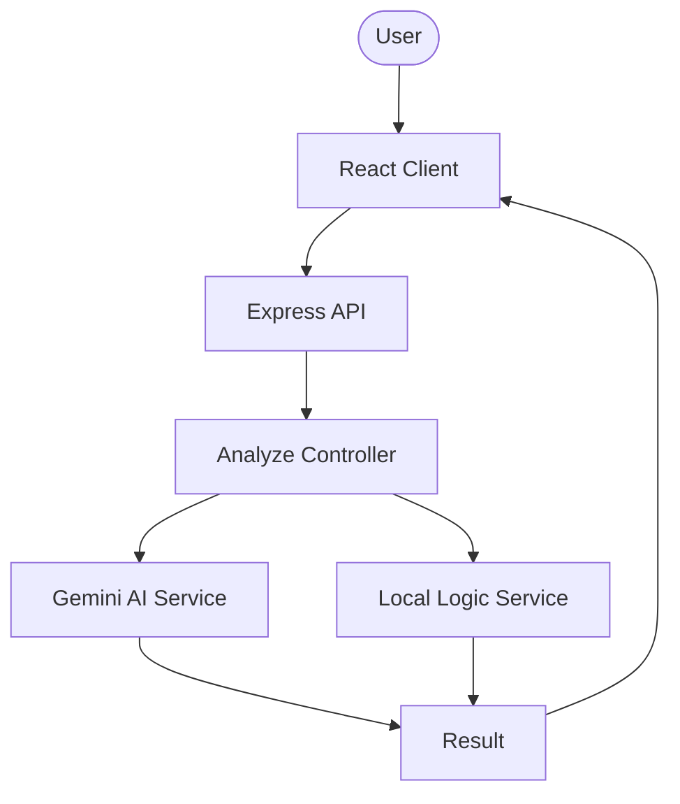

# Context Guard 🛡️

**Context Guard** is a professional-grade full-stack application that leverages Artificial Intelligence to analyze text content for risk, emotion, and sentiment before posting on social media platforms.

---

## 🚀 Key Features

- **AI-Powered Analysis**: Uses Google Gemini 1.5 Flash for deep contextual understanding.
- **Robust Fallback Engine**: Proprietary logic ensures analysis works even without an internet connection or API key.
- **Glassmorphic UI**: High-end modern design built for performance and accessibility.
- **Automated Testing**: Integrated Jest test suite for engineering reliability.
- **Platform Awareness**: Customizes suggestions for LinkedIn, Instagram, and Twitter.

---

## 🏗️ Architecture

---

## 💻 Tech Stack

| Layer       | Technology                     |
|------------|--------------------------------|
| **Frontend**   | React, Modern CSS (Glassmorphism) |
| **Backend**    | Node.js, Express               |
| **AI**         | Google Gemini 1.5 Flash        |
| **Testing**    | Jest, Supertest                |
| **Database**   | MongoDB Atlas                  |

---

## 🧪 Challenges Overcome (Case Studies)

### 1. Handling AI Failures (Graceful Degradation)
**Problem**: Third-party APIs can be unreliable or hit rate limits.
**Solution**: Implemented a **Fallback Engine** that uses local keyword-matching and sentiment analysis as a safety net. This ensures the app is always functional.

### 2. Prompt Engineering for Structured Data
**Problem**: LLMs often return unstructured text, which is hard to parse in an API.
**Solution**: Designed a strict prompt to force the LLM to return valid JSON, coupled with regex-based cleaning logic for robust parsing.

---

## 📂 Project Structure

*(Detailed structure below...)*
